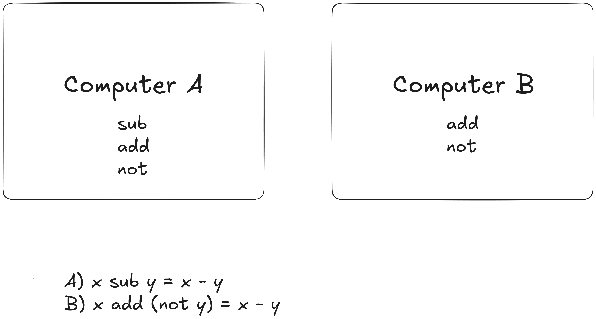

# Exercise for Chapter 01

### 1.1 Ideas

1. Idea of the Universal computer i.e every computer can compute the same problem if given enough time and memory.
2. Problems must be transformed through layers form the natural/human language to bits that the computer electronic can execute

### 1.2

No, a higher level language only creates abstractions that make it easier to organize thoughts and worry less about the peculiarities of the machine on which the program is being run. Higher and lower level languages can be used to compute the same set of problems.

### 1.3

It is difficult to increase the accuracy of analog computers unlike their digital counterparts.

### 1.4

Natural languages are ambiguous and computers don't want to decide or choose between multiple interpretations of the same set of instructions.

### 1.5

Solved as expressed in this image 

### 1.6

**Statement:** "Light dey"

Possible interpretations:

1. Is there Light?
2. There is light.

### 1.7

**Statement:** "Take me to the airport."

Possible interpretations

1. As a productivity enhancer, it is simple and short. Worries less if some part of the road is blocked since the driver follows the best route he knows based on recent events. This is based on the assumptions that drivers keep in touch with road safety news.
2. Negative consequence, if you don't have idea of how long it takes to get to the airport, the driver may take a longer route and may charge so much more due to your ignorance.

### 1.8

**Statement:** "I saw the man in the park with a telescope."

1.  Possible interpretations:
    - I used a telescope to observe/see the man in the park.
    - There was a man in the park who was with a telescope.
2.  This sentence demonstrates ambiguity.

### 1.9

Yes, natural languages can express algorithms.

### 1.10 An algorithm

1. Computable: should be possible to execute as a unit
2. Finite: Has an end. I.e. the process terminates
3. Unambiguous/Definite/Precise

### 1.11 Samples

1. Non-computable: Feel pain
2. Infinite: a recursion that never ends
3. Ambiguous: I am mocking (verb or noun) bird.

### 1.12

1. No, it is not an algorithm as it is indefinite and ambiguous. How do you add the elements of the row to the elements of another row? In what order? There are two rows that start with a non-zero entry, which one should be used?
2. It is not an algorithm it is an infinite process. There is no end to numbers.
3. Yes, it is an algorithm.
4. Yes, it is an algorithm. Each step is definite and it terminates. And the instructions are unambiguous.
5. It is not an algorithm as it is not finite. The process will terminate only if the input is a positive integer else, there is no end to it. The steps from 1 to 6 is summarized as (x - 1) where x is the input.

### 1.13

None can solve more problems than the other. The only difference is it will take Computer B an extra operation to perform a substraction unlike Computer A that can do so in just one step. See in the image below:

### 1.14

Alg (4) >> HLL (5) >> ISA (2) >> MicroA (3 for each ISA)

As Illustrated in the  below.

1. There are 4 by 5 by 2 by 3 = 120 possible transformation processes.
2. Three examples of the transformation processes
    - Alg1 >> C >> x86 >> Pentium IV MicroArchitecture (P4MA)
    - Alg1 >> C >> SPARC >> P4MA
    - Agl1 >> Paschal >> x86 >> P4MA
3. Given only 2 different MicroArchitectures for x86 and 4 different MicroArchitectures for SPARC, there.
There will be 4 by 5 by 6 = 120 possible transformation processes. Check as in the image above 'Exercise 1.14c'.

### 1.15

Programming in higher-level language provides abstractions that reduce the workload in writing instructions for different microarchitectures, allowing the programmer to work faster.

However, it might cause problems when combining the component with another high level component as they both may have different assumptions. This may even increase redundant problem solving.

### 1.16

1. An ISA specifies the possible **operations** it can perform.
2. It specifies the **data types** of inputs and outputs.
3. It also specifies how memory address modes. i.e. how input/output values are stored, accessed or modified.

### 1.17

An Instruction Set Architecture (ISA) specifies a contract for communication between a higher-level language and the microarchitecture.

While, the microarchitecture is the implementation or actions taken by the circuit based on the ISA.

### 1.18

A single microarchitecture understands/implements only one ISA.
Conversely, a single ISA can be implemented in various versions/different microarchitectures based on perculiarities of the problem the processor will be solving.

### 1.19

1. Problem: sorting of items in numerical order.
2. Algorithm: Merge sort algorithm.
3. Higher-level Language: C language.
4. Instruction Set Architecture: x86 assembly by Intel coorporation.
5. Microarchitecture: Pentium IV MicroArchitecture
6. Circuits: PCB and logic gates
7. Device: Raspberry Pi
Correction:Devices here are the types of semiconductor technology used egs:
    - Gallium-Arsenide: a non-silicon technology. Extremely fast frequency.
    - Complementary Metal-Oxide Semiconductors (CMOS) >> dominant today
    - Negative-channel Metal-Oxide Semiconductors (NMOS)
    - Positive-channel Metal-Oxide Semiconductors (PMOS)

### 1.20

Yes, they are all levels of abstractions as the details of each level is hidden from the level above it. E.g A source code in C language does not always mind whether it will run on machine that uses x86 or SPARC ISA. Once the compiler is available, it will always run.

### 1.21

The word processing software is often in the level of ISA. For example, LibreOffice/CorelDraw/etc. for Windows 11 always specifies it is for x86, 64-bit machine. Meaning it is an ISA written in x86 that only microarchitectures that implement x86 can process.
Correction: Also, it is in the ISA because the user doesn't need to compile or assemble it before use. So, it must be in the correct machine language or ISA.

### 1.22

It will be most difficult while converting to the lowest level as an single mistake here spirals upwards and condemns the whole solution. That is from circuit to device. You are literally  drilling and soldering circuit components at a time.

### 1.23

Maintaining the ISA across multiple generation of microarchitectures means that softwares written for previous generations of MAs can still run.
Correction: This feature is also called **backward compatibility**.
