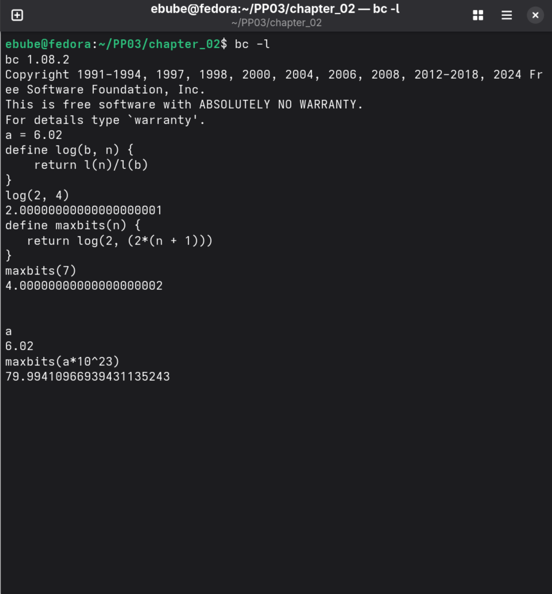

### 2.1

|   Number of bits(n)   |   Number of possible combinations |
|:---------------------:|:---------------------------------:|
|   0   |   0   |
|   1   |   2   |
|   2   |   4   |
|   3   |   8   |
|   n   | 2n |

Therefore, given *n* bits, we can repesent 2n distinct combinations.

### 2.2

26 combinations

n ~= log226

4 < n < 5

Therefore, the minimum number of bits reqruired to represent the 26 character alphabet is 5 bits.

To distinguish between uppper and lowercase version we need (26 * 2) distinct representations.

n ~= log252

5 < n < 6

Therefore, to represent the 52 character alphabet will reqruire at least 6 bits.

Proper formula: To represent an alphabet with *n* different characters, the least number of bits required, *x* is

x = $\lceil log_2(n) \rceil$

### 2.3

1. For 400 different students we need = $\lceil log_2(400) \rceil$ = 9. So we need 9 bits.
2. 9 bits is enough for 512 students. So extra 112 students can be admitted.

### 2.4

Given *n* bits we can represent **$2^n$** unsigned integers in the range 0 to $2^n$ - 1

### 2.5

Using 5 bits to represent 7 and -7

|   Representation  |   7   |   -7  |
|:---:|:---:|:---:|
| 1's complement | 00111 | 11000 |
| signed magnitude | 00111 | 10111 |
| 2's complement | 00111 | 11001 |

### 2.6

6 bits 2's complement representation of -32.

0 = 000000

32 = 010000

-32 = 110000

### 2.7

Create a table showing the decimal values of all four-bit 2’s complement
numbers.

$2^4$ = 16. So our range is from $-2^{4-1}$ to $+2^{4-1} - 1$. That is -8 to +7.

| 4-bit number | Decimal value |
|:---:|:---:|
| 1000 | -8 |
| 1001 | -7 |
| 1010 | -6 |
| 1011 | -5 |
| 1100 | -4 |
| 1101 | -3 |
| 1110 | -2 |
| 1111 | -1 |
| 0000 | 0 |
| 0001 | 1 |
| 0010 | 2 |
| 0011 | 3 |
| 0100 | 4 |
| 0101 | 5 |
| 0110 | 6 |
| 0111 | 7 |

### 2.8

1. $2^8$ = 256. i.e from -128 to +127. So the largest positive number is $127_{10}$ also $0111111_2$.
2. It will be $-128_{10}$ also $1000000_2$.
3. In *n* bit 2's complement code, the largest positive number is $2^{n-1} - 1$.
4. $2^{n-1}$ is the greatest magnitude negative number in an *n*-bit 2's complement binary representation.

### 2.9

How many bits are needed to represent Avogadro’s number (6.02 ⋅ 1023 )
in 2’s complement binary representation?

#### Solution

Given a number *+A*. If it were to be the max number in its range, the range would be

-(A+1) to +A

Total numbers needed would be: $\lvert -(A + 1) \rvert$ + 1 + A$

The extra 1 is for zero

Total numbers required: 2(A + 1)

Remeber min number of bits, *n*, required to represent a decimal number *y* is

n = $\lceil log_2(y) \rceil$

Using y = 2(A + 1)

n = $\lceil log_2(2(A + 1)) \rceil$

= $\lceil log_2(2((6.02 * 10^23) + 1)) \rceil$

Which gives us the value: 80

See the image below for workings. The calculator got 79.994. Rounding it up gives 80. So we need **80 bits** to represent the Avogadro's number.

### 2.10

1. $invert(1010) + 0001 = 0101 + 0001 = 0110_2$
