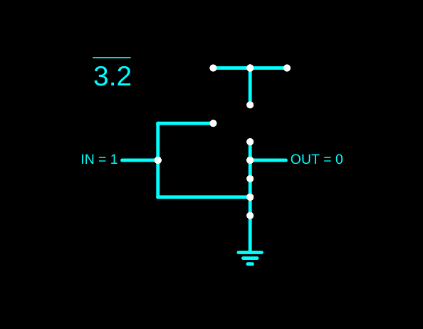
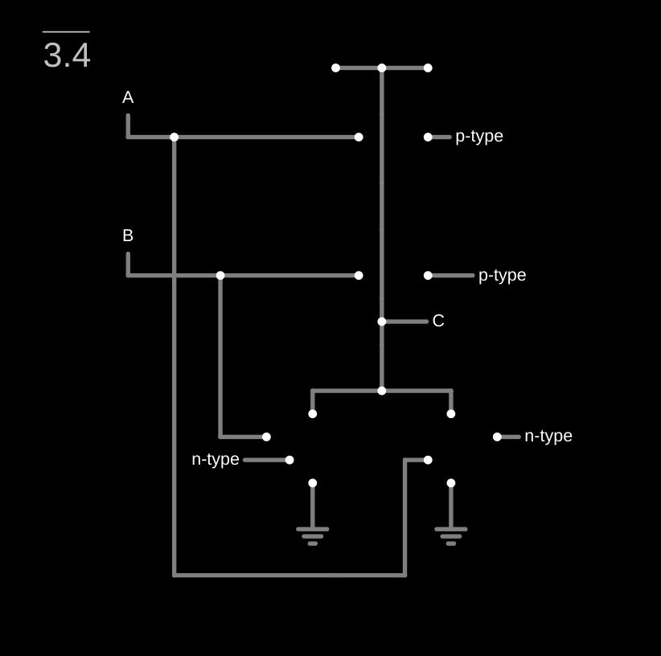
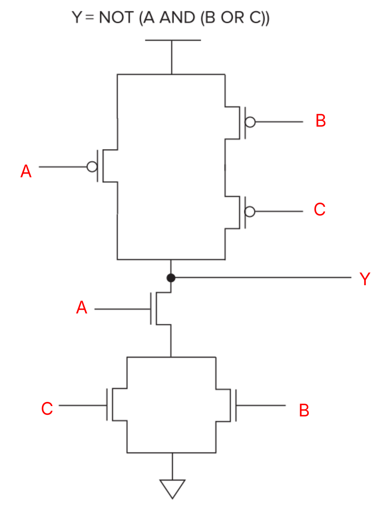

### 3.1

Gate = 1: N-type is closed and P-type is open
Gate = 0: N-type is open and P-type is closed

### 3.2 

See in 

### 3.3

A two-input logic function, F, takes inputs A, B.

F(A,B) = 0 or 1 as possible values

Each of A, B can be either 1 or 0

A, B can be arranged in four possible ways
00, 01, 10, 11

And can be paired with ouputs that can be either 0 or 1

So for each combination of A, B, the output can be 0 or 1.

The question is asking how many total combinations are possible.

For each it can be 2 outputs

so 2 x 2 x 2 x 2 = 16 possible arrangements.

So, there are 16 two-input logic functions are possible.

### 3.4

See in 

Truth table of the circuit

| A | B | C |
|:---:|:---:|:---:|
| 0 | 0 | 1 |
| 0 | 1 | 0 |
| 1 | 0 | 0 |
| 1 | 1 | 0 |

This is typical of a NOR gate

### 3.5

| A | B | C | OUT |
|:---:|:---:|:---:|:---:|
| 0 | 0 | 0 | 1 |
| 0 | 0 | 1 | 0 |
| 0 | 1 | 0 | 1 |
| 1 | 0 | 0 | 1 |
| 0 | 1 | 1 | 0 |
| 1 | 1 | 0 | 0 |
| 1 | 0 | 1 | 0 |
| 1 | 1 | 1 | 0 |

This looks like a table for

OUT = NOT(C) AND (NOT(A) OR NOT(B))

### 3.6

| A | B ||  C | D | Z |
|:---:|:---:|:---:|:---:|:---:|:---:|
| 0 | 0 | | 1 | 1 | 0 |
| 0 | 1 | | 1 | 0 | 0 |
| 1 | 0 | | 0 | 1 | 0 |
| 1 | 1 | | 0 | 0 | 1 |

This is a truth table for AND gate

Z = C NOR D

C = NOT A

D = NOT B

### 3.7

In volts.

| A | B | OUT |
|:---:|:---:|:---:|
| 0 | 0 | 5 |
| 0 | 5 | 2.5 |
| 5 | 0 | 2.5 |
| 5 | 5 | 0 |

So when A is different from B, the output is indeterminate. Since it is not specifically high or low logic output but in betweeen. This is because of short circuting that grounds the inputs from the p-type transistors.

### 3.8

See in 

### 3.9

If A is High (1), the right PMOS will connect the voltage supply (VDD) to OUT and to the right NMOS which connects to ground. This creates a short circuit.

If A is Low (0), OUT is neither connected to the voltage source nor ground. We say OUT is **floating** because nothing keeps it in either of our logic levels High or Low.

### 3.10

1 = NOT(A) AND NOT(B) AND C AND D AND E AND NOT(F)
